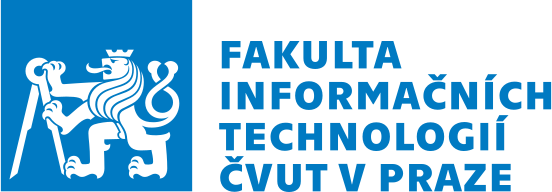

# Fiťácký informatický korespondenční seminář

Řešení algoritmických úloh z programovací soutěže pořádané Fakultou informačních technologií Českého vysokého učení technického v Praze

## Archiv

| Ročník | Kolo | Úloha | Zadání                                                                         | Řešení                                                    |
| ------ | ---- | ----- | ------------------------------------------------------------------------------ | --------------------------------------------------------- |
| 8.     | 1.   | 3.    | [pozemky.pdf](https://fiks.fit.cvut.cz/files/tasks/season8/round1/pozemky.pdf) | [pozemky.cpp](./tasks/season8/round1/pozemky/pozemky.cpp) |
